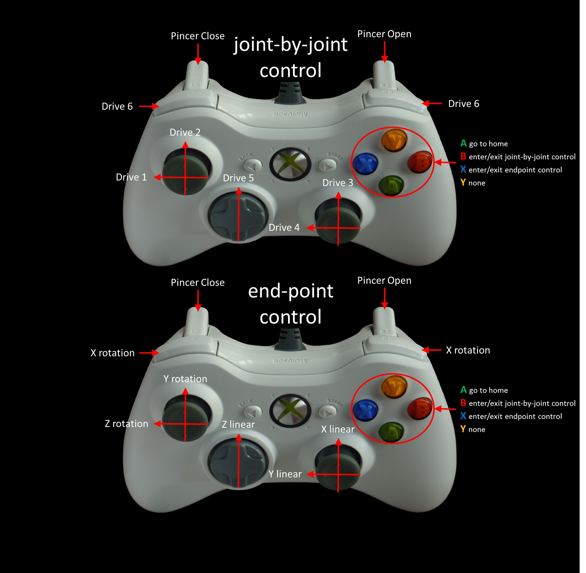

# XBox 360 Joy Control

## Joy test

```bash
ls /dev/input/
sudo jstest /dev/input/js0

Driver version is 2.1.0.
Joystick (Microsoft X-Box 360 pad) has 8 axes (X, Y, Z, Rx, Ry, Rz, Hat0X, Hat0Y)
and 11 buttons (BtnX, BtnY, BtnTL, BtnTR, BtnTR2, BtnSelect, BtnThumbL, BtnThumbR, ?, ?, ?).
Testing ... (interrupt to exit)
Axes:  0:  -349  1:    81  2:-32767  3:   436  4:   813  5:-32767  6:     0  7:     0 Buttons:  0:off  1:off  2:off  3:off  4:off  5:off  6:off  7:off  8:off  9:off 10:off
```

### [Microsoft Xbox 360 Wired Controller for Linux](http://wiki.ros.org/joy)

#### Original mapping

- **Table of index number of /joy.buttons:**

|Index|Button name on the actual controller|joint control| end-effector control|
|-----|------------------------------------|-|-|
|0|A|go home|go home|
|1|B|joint contrl|joint control|
|2|X|end-effector control|end-effector control|
|3|Y|
|4|LB|joint6 (-)|X rotation|
|5|RB|joint6 (+)|X rotation|
|6|back|
|7|start|
|8|power|
|9|Button stick left|
|10|Button stick right|

- **Table of index number of /joy.axes:**

|Index|Axis name on the actual controller|joint control|end-effector control|
|-----|----------------------------------|-|-|
|0|Left/Right Axis stick left|joint1|Z rotation|
|1|Up/Down Axis stick left|joint2|Y rotation|
|2|LT|pincer close|Pincer Close|
|3|Left/Right Axis stick right|joint4 (-)|Y linear|
|4|Up/Down Axis stick right|joint3|X linear|
|5|RT|pincer open|Pincer Open|
|6|cross key left/right|None|None|
|7|cross key up/down|joint5|Z linear|

## HDT Angler Joy Control



#### changed mapping

- **Table of index number of /joy.buttons:**

|Index|Button name on the actual controller|joint control| end-effector control|
|-----|------------------------------------|-|-|
|0|A|go home|go home|
|1|B|joint contrl|joint control|
|2|X|end-effector control|end-effector control|
|3|Y|
|4|LB|<s><span style="color:red">joint6 (-)</span></s>|<s><span style="color:red">X rotation</span></s>|
|5|RB|<s><span style="color:red">joint6 (+)</span></s>|<s><span style="color:red">X rotation</span></s>|
|6|back|
|7|start|
|8|power|
|9|Button stick left|
|10|Button stick right|

- **Table of index number of /joy.axes:**

|Index|Axis name on the actual controller|joint control|end-effector control|
|-----|----------------------------------|-|-|
|0|Left/Right Axis stick left|joint1|Z rotation (-)|
|1|Up/Down Axis stick left|joint2|Y rotation (?)|
|2|LT|pincer close|Pincer Close|
|3|Left/Right Axis stick right|joint4 (-)|Y linear|
|4|Up/Down Axis stick right|joint3|X linear|
|5|RT|pincer open|Pincer Open|
|6|cross key left/right|<span style="color:red"> joint6</span>|<span style="color:red"> X rotation (?)(velocity low?)</span>|
|7|cross key up/down|joint5|Z linear|