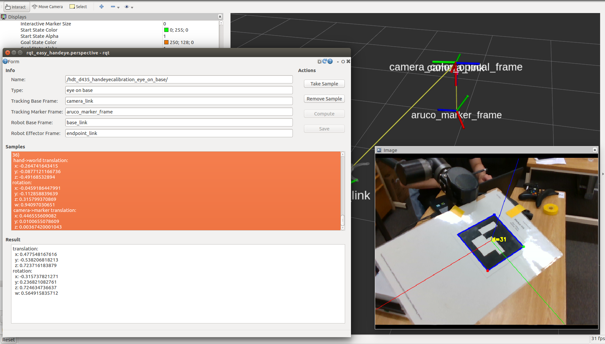

# HDT calibration

## Installation

```bash
cd ~/catkin_ws/src/
sudo apt-get install ros-kinetic-realsense2-*
git clone https://github.com/IFL-CAMP/easy_handeye.git
git clone https://github.com/pal-robotics/aruco_ros.git
rosdep install --from-paths src --ignore-src -r -y
```

## Calibration

```bash
roslaunch realsense2_camera rs_camera.launch
roslaunch hdt_calibration single.launch
roslaunch hdt_angler_bringup angler_a1_bringup.launch
roslaunch hdt_calibration hdt_d435_calibration.launch 
```


## Results

translation: 
  x: 0.477548167616
  y: -0.538206818213
  z: 0.723716183879
rotation: 
  x: -0.315737821271
  y: 0.236821082761
  z: 0.724634736637
  w: 0.564915835712

## Usage

```
roslaunch hdt_calibration hdt_d435_bringup.launch
```